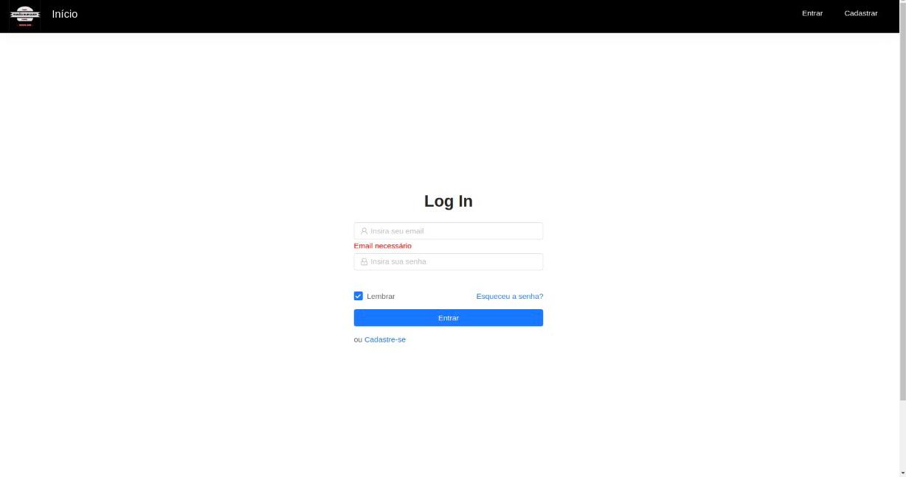

This is a store for a local business that no longer exists (the owner sold it to someone else). It's a fully functional e-commerce react store
that sells food and drinks.

To use this application:

1. make dev.js file inside config folder 
2. put mongoDB info into dev.js file 
3. Type  " npm install " inside the root directory  ( Download Server Dependencies ) 
4. Type " npm install " inside the client directory ( Download Front-end Dependencies )

If you have problem, feel free to ask me.

About the project:

1. It's using nodemon for live updates
2. Bcrypt to hash passwords
3. One hour webtoken
4. Axios (send data through the browser)
5. React-router-DOM (route pages)
6. Redux store (filter data /middleman)
7. Materialize CSS

If you don't want to access it through the link of the deployed app, here are some prints:

